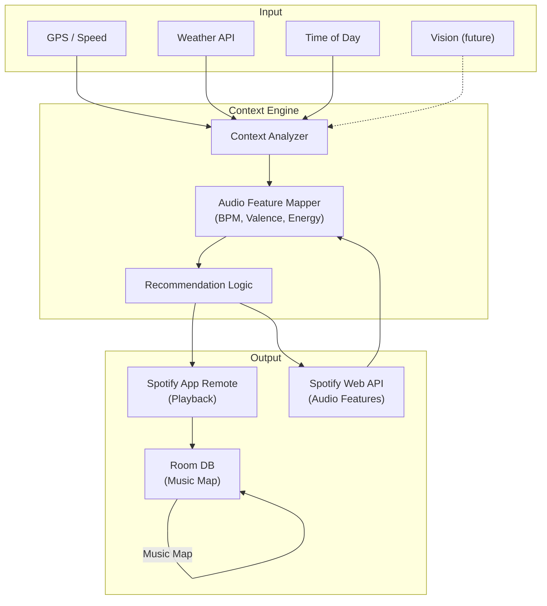

# Yeoui (여의)

**An AI-powered driving companion that reads the road and plays the perfect song — hands-free, real-time, zero input required.**

## What is this?

I got tired of fumbling with Spotify while driving. Skipping songs at 70mph is sketchy, and playlists don't adapt to what's actually happening around you. So I started building Yeoui.

The app reads your driving context in real time — GPS speed, weather, time of day — and maps it directly to Spotify's audio features (BPM, energy, valence) to queue tracks that match the moment. Highway at night gets a different soundtrack than Atlanta rush hour in the rain. No buttons, no voice commands, no interaction needed.

The name comes from 여의주 (Yeouiju), a wish-granting orb from Korean mythology. In the app, context data flows onto the screen as floating tag snippets and converges into an orb that generates your playlist. It's a metaphor, but it also solves a real UX problem: **how do you control a music app when you can't touch your phone?** You don't. The app controls itself.

## The Bigger Picture: Music Map

Every session logs what you listened to, where, at what speed, in what weather, and whether you skipped or finished the track. Over time this builds a **Music Map** — a complete listening footprint across driving contexts.

That data does two things: it makes recommendations smarter with every drive, and it creates something shareable. Think Spotify Wrapped, but for your actual life on the road.

## Architecture



## Tech Stack

- **Language**: Kotlin
- **Architecture**: MVVM (ViewModel + LiveData)
- **Playback**: Spotify App Remote SDK
- **API**: Spotify Web API via Retrofit2
- **Local DB**: Room
- **Sensors**: Android Location Services, OpenWeatherMap API
- **Future**: CameraX + ML Kit for vision-based context, Hilt for DI

## Current Status

**What works:**
- Full Spotify App Remote SDK integration. The app connects to Spotify in the background and handles playback control — play, pause, skip, queue. Getting this stable was honestly the biggest technical hurdle, and it's done.

**What I'm building next:**
- Input pipeline: GPS speed collection + OpenWeatherMap integration
- The core mapping engine: speed → target BPM range, weather → valence shift, time of day → energy curve
- Spotify Web API integration to pull audio features per track

**Down the road:**
- Room DB logging for the Music Map (track + full context snapshot + skip/complete behavior)
- Yeouiju orb animation and the snippet tag UI
- Social sharing — Music Map cards designed for Instagram Stories

## Project Structure

```
app/src/main/java/com/yeoui/
├── data/
│   ├── local/
│   │   └── MusicContextEntity.kt       # Room entity — one row per song+context
│   ├── remote/
│   │   └── SpotifyWebApiService.kt     # Retrofit interface for audio features
│   └── repository/
│       └── MusicRepository.kt
├── domain/
│   └── model/
│       └── DrivingContext.kt           # speed/weather/time → intensity mapping
├── player/
│   └── SpotifyRemoteManager.kt        # Spotify App Remote wrapper
├── ui/
│   ├── main/
│   └── orb/
└── util/
```

## Setup

You'll need:
- Android Studio Hedgehog or later
- Spotify Premium account with the Spotify app installed
- Spotify Developer credentials ([dashboard](https://developer.spotify.com/dashboard))

```bash
git clone https://github.com/YOUR_USERNAME/yeoui.git
```

Add to `local.properties`:
```properties
SPOTIFY_CLIENT_ID=your_client_id
SPOTIFY_REDIRECT_URI=yeoui://callback
```

## Why I'm building this

I'm studying Computer Science at Georgia Tech. I started in Computer Engineering, but building Yeoui made something click — I realized the problems I actually want to solve live in software: turning noisy real-world signals into something intelligent, personal, and useful. This project is where that shift happened, and I'm still building it.

---

Built by Wonseok
