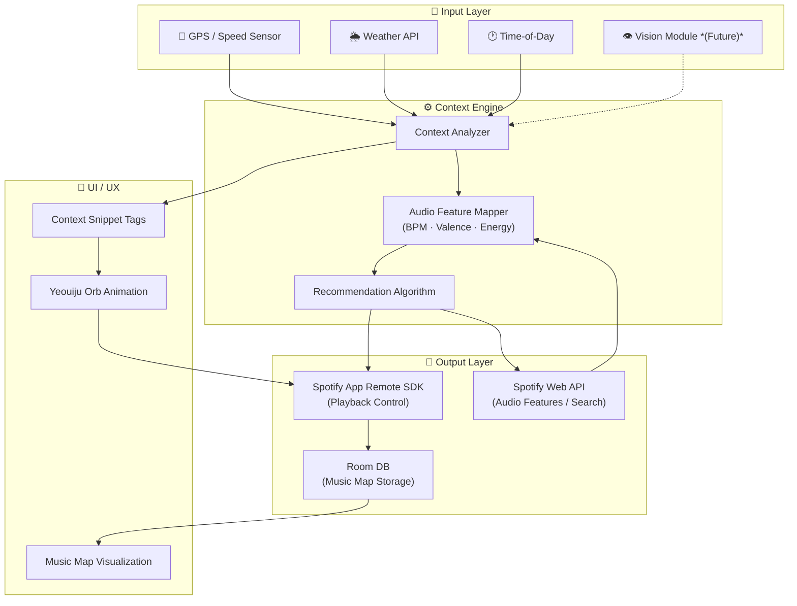

# Yeoui (여의) 🔮

**Your environment is the DJ. An AI-powered driving companion that reads the road and plays the perfect song — hands-free, real-time, zero input required.**

## 💡 Why I started building this

As someone who composes music, I'm obsessed with how sound matches a moment. But while driving, I found myself constantly fumbling with Spotify to find the right vibe for the weather or the road. Skipping songs at 70mph is sketchy, and static playlists just don't adapt to what's actually happening outside the windshield.

So I started building Yeoui.

The app reads your driving context in real time — GPS speed, weather, time of day — and maps it directly to Spotify's audio features (BPM, energy, valence). A late-night empty highway gets a completely different soundtrack than a rainy rush hour in Atlanta. No buttons, no voice commands—it just plays what fits.

## 🔮 The UX: "Yeouiju"

The name comes from *Yeouiju* (여의주), a wish-granting orb from Korean mythology.

Since you can't (and shouldn't) touch your phone while driving, I needed a completely different UX. In Yeoui, environmental data flows onto the screen as floating tag snippets (e.g., `#Rain`, `#Highway`) and converges into an orb that "spits out" your playlist. It's a visual metaphor, but it solves a real UX problem: **how do you control a music app when you can't touch your phone?** You don't. The app controls itself.

## 🗺️ The Bigger Picture: Music Map

Beyond just playing music, every session logs what you listened to, where, at what speed, in what weather, and whether you skipped or finished the track.

Over time, this builds a **Music Map** — a complete listening footprint across driving contexts. This data makes recommendations smarter with every drive, and creates something uniquely shareable. Think *Spotify Wrapped*, but dynamically mapped to your actual life on the road.

## 🏗️ Architecture & Tech Stack

**Tech Stack:**

* **Language**: Kotlin
* **Architecture**: MVVM (ViewModel + LiveData)
* **Playback**: Spotify App Remote SDK
* **API**: Spotify Web API via Retrofit2
* **Local DB**: Room
* **Sensors**: Android Location Services, OpenWeatherMap API
* **Future**: CameraX + ML Kit (Vision), Hilt (DI)

**System Architecture:**



## 🚀 Current Status

I'm building this iteratively.

**What works right now:**

* **The Output Pipeline:** Full Spotify App Remote SDK integration. The app connects to Spotify in the background and handles playback control (play, pause, skip, queue). Getting this stable was honestly the biggest technical hurdle, and it's done.

**What I'm building next:**

* **Input Pipeline:** Hooking up GPS speed collection + OpenWeatherMap integration.
* **Core Mapping Engine:** Speed → target BPM range, Weather → valence shift, Time of day → energy curve.
* **Web API:** Pulling real-time audio features per track.

**Down the road:**

* Room DB logging for the Music Map (track + context snapshot + skip/complete behavior).
* The *Yeouiju* orb animation and snippet tag UI.
* Social sharing — Music Map cards designed for Instagram Stories.

## 📂 Project Structure

```text
app/src/main/java/com/yeoui/
├── data/
│   ├── local/
│   │   └── MusicContextEntity.kt       # Room entity — one row per song+context
│   ├── remote/
│   │   └── SpotifyWebApiService.kt     # Retrofit interface for audio features
│   └── repository/
│       └── MusicRepository.kt
├── domain/
│   └── model/
│       └── DrivingContext.kt           # speed/weather/time → intensity mapping
├── player/
│   └── SpotifyRemoteManager.kt        # Spotify App Remote wrapper
├── ui/
│   ├── main/
│   └── orb/
└── util/
```

## ⚙️ Setup

You'll need:
* Android Studio Hedgehog or later
* Spotify Premium account with the Spotify app installed
* Spotify Developer credentials ([dashboard](https://developer.spotify.com/dashboard))

```bash
git clone https://github.com/wons-cpu/yeoui.git
```

Add to `local.properties`:
```properties
SPOTIFY_CLIENT_ID=your_client_id
SPOTIFY_REDIRECT_URI=yeoui://callback
```

---

Built by Wonseok · Georgia Institute of Technology
